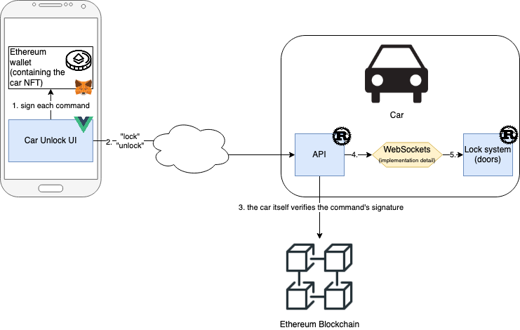
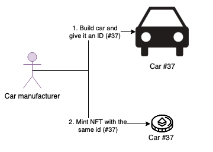
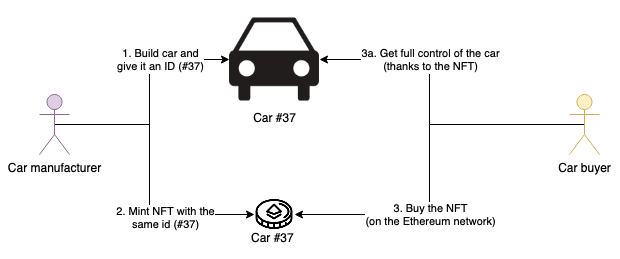
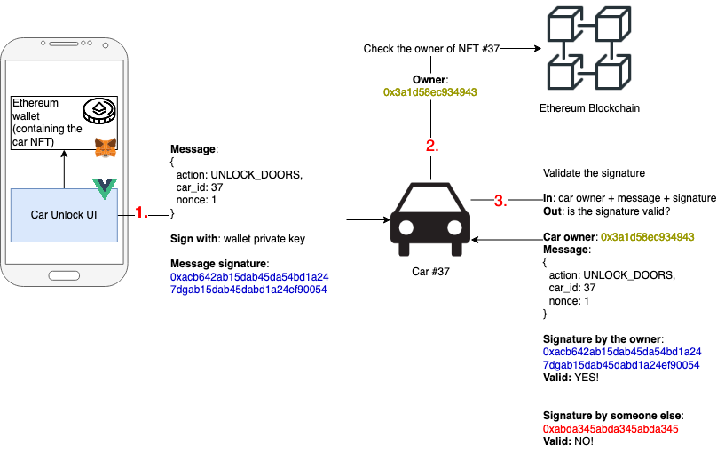
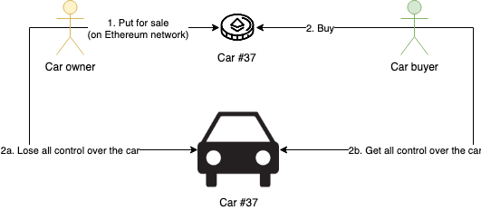

# Overview

This is not about opening/locking the car.
This is about ownership!

## "Classic" ownership

The regular way of owning a car is buying the keys against money:
- cash -> not safe for the buyer, not always convenient for the seller
- regular cheque -> takes time, risky for the seller
- bank wire -> not convenient and risky for the buyer
- bank cheque -> slow, not convenient and expensive for the buyer

All of them require a physical exchange of the car keys. And all of them require payment before the keys are transferred to the new owner.

## NFT ownership

This project is all about showing an alternate way of thinking about ownership, and especially transferring ownership.
It comes with its set of challenges and drawbacks, but it improves a few things:
- it can lessen the need for a legal framework, especially important in less regulated countries. The true ownership is defined programatically, in the Ethereum blockchain
- transfer of ownership is tied to a pre-defined exchange of money, and both happen at the same time (instead of payments => keys)
- totally virtual, which can help mitigate physical aggression/theft risk

Downsides (they can be mitigated):
- subject to DDoS attacks
- if you lose your private key, you lose your car
- additional cybersecurity challenges

## My implementation

In this repo, you'll find several blocks of software:



- a smart contract, in `./nft`, that allows minting and trading NFTs for the cars
- a front-end application, in `./remote-control`, that allows sending commands to a car (e.g. "unlock the doors")
- a mock implementation for a car system:
  - an outside-facing API 
  - a front-end aplication that mocks a car being locked or unlocked. Since I don't own a car I can write programs for, this is one solution I found to have a visual demo.

The "cloud" in the diagram represents the fact that I intentionally abstracted the way we send commands from the Remote Control to the Car API. In my implementation, this is a simple HTTP call. In a real-life implementation, we would could for example go through a car manufacturer public API, that would perform some initial checks and then transmit the commands to the car via MQTT.

# How it works

## 1. The manufacturer creates a car



Whenever the car manufacturer builds a car and wants to sell it, they give the car a unique identifier.
In our example, the car that was created has the unique ID `#37`. It is "hardcoded" into the car and
can never be modified.

After that, they call the smart contract to create an NFT with the same ID, `#37`.
Creating an NFT is called "minting".

There is a rule in the smart contract that says "only the car manufacturer can mint NFTs".
In my implementation, we simply allow a single address (the address that deploys the smart contract)
to mint tokens.
In a real-life implementation, we would probably need smarter rules, for example:
- have back-up addresses that can mint NFTs (=> multi-sig)
- have one different address for each factory, not a single one
- each factory only has access over a range of IDs OR some metadata is added when a specific factory mints...

### Cost

Gas fees for minting the NFT, paid by the manufacturer.

## 2. Someone buys the car



Whoever owns the NFT has full control over the car. We will see how it works, below.

To "own" the car, a potential buyer therefore needs to buy the token.
In the current version of the implementation, there's no way to really "buy" tokens, you can just transfer them. Buying and selling is on my TODO list!

### Cost

Gas fees for transferring the NFT, paid either by the seller or the buyer.

## 3. The owner uses the car

Lock or unlock the doors, start the engine...



That's where it gets interesting! We'll see how the car owner is able to use the car, without any fees, and nobody else can.

### Ethereum wallets (accounts), private keys, public keys

Very detailed explanation: [The Ethereum paper](http://gavwood.com/paper.pdf).  
Official, beginner friendly explanation: [Ethereum accounts](https://ethereum.org/en/developers/docs/accounts/).

Ethereum wallets store private keys - for example `0xabcd123`.
This is never revealed to anyone - hence the name, private key.

With a private key, you can do two things:

**Derive a public key**

Each private key has one - and only one - associated public key.
You can get a public key from a private key, using [an algorithm](https://en.wikipedia.org/wiki/Elliptic_Curve_Digital_Signature_Algorithm).

You can then communicate your public key to anyone you want to interact with.

**Sign messages**

By hashing a message with your private key, you get a message signature.
Anyone is able to validate the signature of the message, if they just know your public key and the message input.

### Owner unlocks the car

To unlock the car (or use the car in any other way), we're not interacting with the smart contract.

**`1`**

First, we prepare the command we'll send to the car:

```yaml
action: OPEN_DOORS
car_id: 37
nonce: 1 # explained below
```

We sign this message with our private key. We get a signature for it, for example `0xacb642ab15dab45da54bd1a24
7dgab15dab45dabd1a24ef90054`.

We can then send the message and the signature, to the car.

**`2`**

The state of the Ethereum blockchain is public, and anyone can query it.
Whenever the car receives a message, it will query that state to see who's the owner of its NFT.

In our example, the car knows its own ID is `#37`, so it will look for the owner of NFT `#37` which is `0x3a1d58ec934943`.

The car performs this check every time it receives a command, to make sure the owner has not changed.

**`3`**

Now, the car has all the info it needs:
- who is the rightful owner of its NFT
- the message it received
- the signature of the message

It can simply validate if the signature was indeed created by the owner.
If it is, the car API can simply tell the car lock system to unlock the doors.

In my implementation, it communicates via WebSockets.
A real-life implementation would use a more suitable communication method.


### Non-owner tries to unlock the car

If someone else than the owner tries to send a command to the car, they will not be able to sign their message with the private key of the wallet that owns the NFT. What that means is, even if they successfully send a message to the car (e.g. "Unlock the doors"), the car will not be able to validate the message signature with the public key of the owner (in our example, `0x3a1d5....`).

### Non-owner intercepts then repeats a command that was sent to the car

That's where the nonce comes into play.
The car will only accept each nonce once. Imagine the owner sent this message:
```yaml
action: OPEN_DOORS
car_id: 37
nonce: 1
```

The next time the owner wants to open the car, they'll have to use a different nonce (e.g. `nonce: 2`). If the car sees that the nonce was already before, it will reject the command.

So, in our case, if a "hacker" intercepts the message to unlock the car and sends it again later, the car will reject it.

### Cost

No gas fees - we're just signing a message and sending it outside the Ethereum network.

Checking the Ethereum state is also free. To be totally accurate, you can either have your own nodes that have a copy of the state, in which case you need to maintain your own machines and build an API for them, or you can use a provider (I used [Infura](https://infura.io/)). Most providers would maintain the nodes for you and give you some free requests, but
you'd have to be on a paid plan to do significant numbers of queries.

## 4. The owner resells the car

On a marketplace, directly to someone else...



Note: this is not implemented yet, for now you can just transfer tokens but not buy/sell them.

Whenever you buy the token of a car (in our case, `#37`), you immediately get full control over the car - and the previous owner loses the control.

If you understood the previous section, you will understand why it works: with every command it receives, the car checks who the owner is. So whenever the NFT ownership changes, the previous owner will immediately stop being able to issue any command to the car. Indeed, all the message signatures he will produce will now be invalid (see [Non-owner tries to unlock the car](#-Non-owner-tries-to-unlock-the-car)).

### Cost

Gas fees for transferring the NFT, paid either by the seller or the buyer.

# TODO

- Shared configuration (ports, web3 API address...)
- Single setup command for all the parts of the project
- Allow selling/buying tokens, not just transferring
- Video demo
